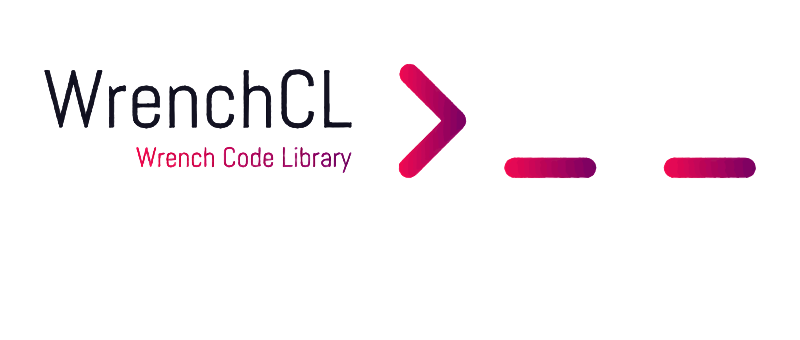

  

   

    
    
    
  

 

  ## Overview
  Welcome to the Wrench Code Library repository. This repository serves as the main entry point and contains important documentation and workflow configurations.

  

  ## Branches

  ### V2 (Current Version)
  The V2 branch is the latest stable release of our project. This version includes new features and improvements but is not backwards-compatible with WrenchCL v1. 
    
  <a href="https://github.com/WrenchAI/WrenchCL/tree/v2">V2 Branch Source</a>

  ### V1 (Deprecated)
  The V1 branch is the previous version of our project. This version is now deprecated and will not receive further updates or support. It remains available for legacy compatibility. 
    
  <a href="https://github.com/WrenchAI/WrenchCL/tree/v1">V1 Branch Source</a>

 

  ## Important Notices
  

    <ul style="list-style-type: none; padding: 0; text-align: center;">
      <li>Deprecation Notice: V1 is deprecated and will no longer receive updates or support. Users are encouraged to migrate to V2.</li>
      <li>Compatibility: V2 is not compatible with legacy systems or the V1 branch. Ensure you review the documentation and migration guides before upgrading.</li>
    </ul>
  

 

  ## Documentation
  For detailed documentation, installation instructions, and usage examples, please refer to the README files in the respective branches:
  

    <ul>
      <li ><a href="https://github.com/WrenchAI/WrenchCL/blob/v2/README.md">V2 Documentation</a></li>
      <li><a href="https://github.com/WrenchAI/WrenchCL/blob/v1/README.md">V1 Documentation</a></li>
    </ul>
  
 
 

  ## License
  This project is licensed under the MIT License.

